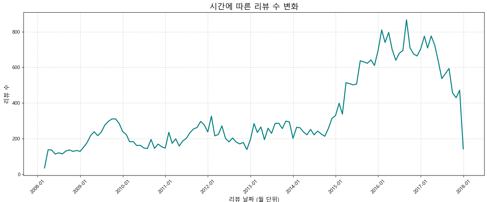

## MobileMert를 활용한 약물 리뷰 분석 프로젝트

---


---


## 1. 개요
UCI ML drug Review dataset은 UCI 머신 러닝 저장소에 게시되어 있는 약물 검토 데이터셋이다.이 데이터세트는 특정 약물에 대한 환자 리뷰와 관련 질환에 대한 리뷰를 제공합니다. 리뷰와 평점은 효능, 부작용, 그리고 전반적인 의견의 세 가지 측면에 대한 보고서로 분류됩니다.

### 1.1 문제 정의
  
  현대 사회에서 약물 치료는 다양한 질환에 대한 핵심적인 치료 방법으로 자리 잡고 있다. 그러나 동일한 약물에 대해서도 환자 개인의 경험과 반응은 매우
상이하다. 일부 환자는 특정 약물에 대해 긍정적인 효과를 경험하는 반면, 다른 환자들은 부작용이나 효과 부족 등의 이유로 부정적인 평가를 내리기도 한다.
이 프로젝트는 Kaggle에서 제공하는 UCI ML drug Review라는 데이터셋을 바탕으로 다양한 질환을 겪는 환자들이 복용하는 약물에 대한 긍부정을 예측하는
인공지능 모델을 개발하고자 한다.

---
## 2.데이터
### 2.1 데이터 출처
 
  kaggle : https://www.kaggle.com/datasets/jessicali9530/kuc-hackathon-winter-2018

### 2.2 데이터 구성

|데이터| 구분                |
|---|-------------------|
|uniqueID| 고유 번호             |
|drugName| 약물 이름             |
|condition| 환자 병명             |
|review| 리뷰                |
|rating| 평점                |
|date| 날짜                |
|usefulCount| 리뷰가 유용하다 느낀 사용자 수 |

### 2.3 시각화 자료


시각화된 그래프를 통해 리뷰 수는 특정 시기마다 뚜렷한 변화를 보이는 것을 확인할 수 있다. 특히 2012년부터 2016년 사이에 리뷰 수가 꾸준히 증가했으며, 이는 사용자의 참여도가 높아졌거나 플랫폼의 인지도가 증가한 것으로 해석할 수 있다. 이후 일부 기간에는 일시적인 감소 또는 정체 현상도 나타났는데, 이는 약물 리뷰 플랫폼의 활성도 변화, 정책 변경, 또는 사용자 경험 변화 등의 영향일 수 있다.

전반적으로, 리뷰 수가 시간에 따라 점진적으로 증가하는 추세를 보였으며, 이는 사용자들이 점차 온라인 리뷰를 통해 약물 사용 경험을 공유하는 경향이 높아졌음을 시사한다.



유용한 리뷰 수를 기준으로 상위 10개의 약품을 분석한 결과, 레비트라(Levitra), 메트포민(Metformin), 시알리스(Cialis) 등의 약물이 다른 약물에 비해 높은 수의 유용한 리뷰를 받은 것으로 나타났다. 이는 해당 약품들이 사용자 경험 공유가 활발하고, 실제 사용자들에게 효과나 정보 제공 측면에서 큰 도움이 된 경우가 많았음을 시사한다.

또한 상위 약물들 대부분이 만성 질환 치료제 또는 생활의 질에 영향을 주는 약물이라는 점에서, 환자들의 리뷰 참여도가 높았던 것으로 해석할 수 있다.


### 2.3 데이터 가공
* drugsComTest_raw에서 rating(평점)을 기준으로 1,2,3은 0(부정), 8,9,10은 1(긍정)으로 나누어 label행을 추가하였다.
* 임의의 데이터 4400개는 전체 행 중 10%만 무작위로 선택하여 데이터를 나누었다.

## 3 Mobilebert를 사용한 결과(MobileBERT-Finetune-GPU.py)

---

### 3.1 모델 및 도구
- **프레임워크**: PyTorch, HuggingFace Transformers
- **사전학습모델**: `MobileBertForSequenceClassification` (이진 분류용)
- **토크나이저**: `MobileBertTokenizer`
- **데이터셋 구성**:
  - 총 4400개의 리뷰 샘플
  - `train_test_split`을 통해 80% 학습, 20% 검증


### 3.2 전처리 및 데이터셋 구성
- 리뷰 텍스트에 대해 `MobileBERT tokenizer`를 사용하여 **토큰화**하고, 최대 길이를 `256`으로 제한.
- `attention_mask`를 생성하여 패딩 토큰이 무시되도록 처리.
- 데이터셋은 `TensorDataset`으로 변환하여 `DataLoader`에 전달함.
- `batch_size = 8`


### 3.3 학습 및 검증 과정
- 총 4 에폭(epoch) 동안 학습을 진행.
- `AdamW` 옵티마이저와 `linear warmup scheduler` 사용.
- 각 epoch마다:
  - 학습 손실(`loss`) 계산
  - 학습 정확도(`train accuracy`) 및 검증 정확도(`validation accuracy`) 계산
  - 모델은 학습 후 `model.eval()` 상태에서 평가 진행


### 3.4 학습 결과 (Epoch별 성능)

학습이 진행될수록 손실은 감소하고 정확도는 향상됨. 특히 Epoch 2 이후로 정확도는 90% 이상을 유지하여 모델이 효과적으로 파인튜닝되었음을 보여준다.


## 4 Mobilebert를 사용한 결과(MobileBERT-Inference.py)

---

### 4.1 데이터 구성
#### 학습 데이터

- 파일: `drugsComTest_filtered_4400.csv`
- 구성: 리뷰 텍스트 (`review`), 라벨 (`label`)
- 라벨:
  - `0`: 부정
  - `1`: 긍정

#### 테스트 데이터

- 파일: `drugsComTest_filtered_remaining.csv`
- 총 샘플 수: 39,765건
- 동일한 라벨 구조


### 4.2 모델 학습 요약

#### 데이터 전처리

- 토크나이저: `MobileBertTokenizer.from_pretrained('mobilebert-uncased')`
- 최대 길이: 256
- Padding 방식: `max_length`
- Attention Mask 생성

#### 학습 설정

- 모델: `MobileBertForSequenceClassification` (`num_labels=2`)
- Optimizer: AdamW
- Learning Rate: 2e-5
- Epochs: 4
- Batch Size: 8
- Scheduler: Linear warmup

---


### 5.테스트 데이터 평가
#### 5.1 모델 불러오기 및 추론
```python
model = MobileBertForSequenceClassification.from_pretrained("mobilebert_custom_drug_model.pt")
model.eval()
```
* 배치 단위로 `DataLoader`를 통해 전체 테스트셋 추론 수행
* `torch.no_grad()` 블록에서 예측 진행
* `argmax(logits)`로 최종 예측값 도출

---

#### 5.2 정확도 계산
```python
test_accuracy = np.sum(np.array(test_pred) == np.array(test_true)) / len(test_pred)
```
#### 5.3 결과

| 항목               | 값        |
|--------------------|-----------|
| 총 테스트 샘플 수   | 39,765건  |
| 모델 정확도        | 약 97%    |

🔍 전체 데이터 39,765건에 대해 약 97%의 정확도를 달성하며, 학습 모델의 일반화 성능이 우수함을 확인하였습니다.


    


